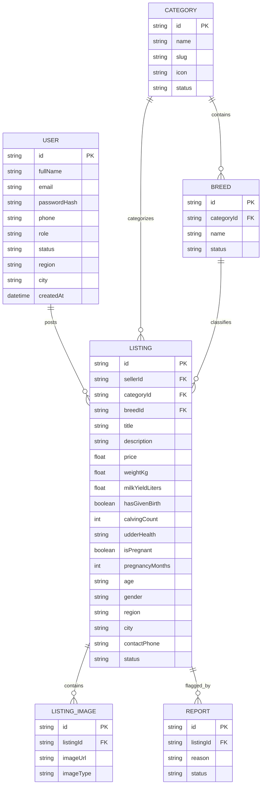

# Axum Market — System Architecture Documentation

## 1. Executive Summary & Domain Purpose

**Axum Market** is a specialized agricultural livestock marketplace platform engineered for the Ethiopian livestock trade. The platform addresses fundamental market inefficiencies in traditional livestock supply chains:
- **Disintermediation**: Directly connects livestock farmers/breeders with buyers (dairy farms, fattening operations, butchers, exporters, and individual consumers), eliminating predatory brokers (*delalas*).
- **Physical Verification & Fraud Prevention**: Operates strictly on an **offline transaction model** — connecting parties online for discovery, while enforcing physical, in-person inspection and cash/bank handover inside registered livestock markets.
- **Deep Livestock Domain Modeling**: Tailored data fields for livestock assessment: daily milk yield, gestation/pregnancy tracking (months 1–9), calving parity, udder health, live weight, and certified breed genetics.
- **Trilingual Accessibility**: Full trilingual user experience supporting **English**, **አማርኛ (Amharic)**, and **Afaan Oromoo (Oromo)**.

---

## 2. High-Level Architecture Diagram

```
                              ┌───────────────────────────────────┐
                              │            Clients                │
                              │  (Mobile Browsers & Desktops)     │
                              └─────────────────┬─────────────────┘
                                                │
                     ┌──────────────────────────┴──────────────────────────┐
                     │                                                     │
                     ▼                                                     ▼
        ┌─────────────────────────┐                           ┌─────────────────────────┐
        │        apps/web         │                           │       apps/admin        │
        │   (Marketplace Web)     │                           │     (Admin Portal)      │
        │   Port: 3000 / Vercel   │                           │   Port: 3001 / Vercel   │
        └────────────┬────────────┘                           └────────────┬────────────┘
                     │                                                     │
                     ├──────────────────────────┐                          │
                     │                          │                          │
                     ▼                          ▼                          ▼
        ┌─────────────────────────┐ ┌───────────────────────┐ ┌─────────────────────────┐
        │  Next.js App Router     │ │ Trilingual Engine     │ │ Next.js App Router      │
        │  • Public Listings Feed │ │ • English / Amharic / │ │ • Seller Verification   │
        │  • Detailed Profiles    │ │   Afaan Oromoo Dict   │ │ • Listing Moderation    │
        │  • Seller Post Workflow │ │ • 0ms Local Presets   │ │ • Taxonomy & Analytics  │
        │  • Dynamic Filters      │ │ • Multi-tier Fallback │ │ • Fraud Incident Queue  │
        └────────────┬────────────┘ └───────────────────────┘ └────────────┬────────────┘
                     │                                                     │
                     └──────────────────────────┬──────────────────────────┘
                                                │
                                                ▼
                                   ┌─────────────────────────┐
                                   │    packages/database    │
                                   │  Prisma ORM Client      │
                                   │  • Multi-target Engine  │
                                   │  • Serverless /tmp Sync │
                                   └────────────┬────────────┘
                                                │
                                                ▼
                                   ┌─────────────────────────┐
                                   │  Storage / Persistence  │
                                   │  • SQLite (dev.db)      │
                                   │  • PostgreSQL / Cloud DB│
                                   └─────────────────────────┘
```

---

## 3. Monorepo Structure & Workspace Topology

Axum Market is organized as an enterprise-grade monorepo managed by **Turborepo** and **npm workspaces**:

```
AxumMarket/
├── apps/
│   ├── web/                     # Customer-facing marketplace application
│   │   ├── app/                 # Next.js 15 App Router (pages & REST APIs)
│   │   │   ├── api/             # API routes: auth, listings, translate, upload...
│   │   │   ├── listings/        # Dynamic feed and detail routes [id]
│   │   │   └── seller/          # Seller portal: registration, login, posting
│   │   ├── components/          # Reusable UI widgets & reactive components
│   │   ├── context/             # React Contexts (LanguageContext, etc.)
│   │   ├── lib/                 # Client & server utilities (JWT auth, utils)
│   │   └── public/              # Static public assets, uploads, and media
│   └── admin/                   # Operations & governance administration portal
│       ├── app/                 # Admin routes: dashboard, moderation, categories
│       ├── lib/                 # Admin auth, sessions, and helpers
│       └── public/              # Admin badges, logos, and UI assets
├── packages/
│   └── database/                # Shared database abstraction package
│       ├── prisma/              # Prisma schema, seeds, and migrations
│       └── src/                 # Resilient Prisma client singleton & sync engine
├── package.json                 # Root monorepo configuration & scripts
└── turbo.json                   # Turborepo task pipeline & caching rules
```

### Monorepo Workspaces

| Package / App | Path | Primary Role | Tech Stack |
| :--- | :--- | :--- | :--- |
| **`web`** | `apps/web` | Public livestock marketplace, search & seller onboarding | Next.js 15, React 19, Tailwind CSS |
| **`admin`** | `apps/admin` | Moderator & administrator back-office | Next.js 15, React 19, Tailwind CSS |
| **`@axum/database`** | `packages/database` | Shared data persistence and Prisma ORM wrapper | Prisma Client 5.22, SQLite / PostgreSQL |

---

## 4. Data Layer & Domain Models

Data persistence is managed via Prisma ORM (`packages/database/prisma/schema.prisma`).



### Key Domain Logic Features:
1. **Maternal & Dairy Intelligence**:
   - `milkYieldLiters`: Daily output benchmark (e.g., 18.5 L/day).
   - `calvingCount`: Parity history (`0` = Heifer/ድንግል, `1+` = Experienced milker).
   - `isPregnant` & `pregnancyMonths`: Gestation tracking from 1 to 9 months, calculating time to calving.
   - `udderHealth`: Veterinary checks (mastitis-free certification, teat symmetry).
2. **Beef & Draft Attributes**:
   - `weightKg`: Live bodyweight estimation for fattening and export.
   - `gender`: Distinguishing dairy cows/heifers from breeding bulls and draft steers.

---

## 5. Security & Authentication Architecture

```
  [User Browser]
         │
         │  1. POST /api/auth/login (email + password)
         ▼
  [Next.js API Handler]
         │
         │  2. Verify credentials via bcrypt (salt rounds: 10)
         │  3. Check User status (must be ACTIVE, not SUSPENDED)
         │  4. Issue signed JWT (HS256, 7-day TTL)
         │  5. Set HTTP-Only, Secure, SameSite=Lax Cookie
         ▼
  [Client Cookies: `axum_token` / `axum_admin_token`]
```

- **Authentication Primitive**: Stateless JSON Web Tokens (JWT) signed with `JWT_SECRET`.
- **Credential Storage**: Passwords hashed with `bcryptjs` using 10 salt rounds.
- **Session Transmission**: Secure HTTP-only cookies (`axum_token` for sellers, `axum_admin_token` for admins) preventing XSS session theft.
- **Role-Based Access Control (RBAC)**:
  - `PUBLIC`: Anonymous browsing, search, view listings, phone call reveal.
  - `SELLER`: Listing creation, inventory management, status tracking (pending verification).
  - `ADMIN`: Global dashboard, KYC seller approval, listing moderation, breed management.

---

## 6. Internationalization (i18n) & Translation Engine

The platform operates across three primary languages:

| Code | Language | Script / Dialect |
| :--- | :--- | :--- |
| `en` | English | Default international commerce lingua franca |
| `am` | አማርኛ (Amharic) | National working language of Ethiopia |
| `om` | Afaan Oromoo | Widely spoken language of Oromia |

### Architectural Flow:
1. **Dynamic UI Dictionary (`LanguageContext.tsx`)**:
   - Provides a typed dictionary for all static navigation, hero titles, search fields, category cards, market mood tabs, and footers.
   - Reactive hook `useLanguage()` provides instant context switching without page reloading.
2. **Listing Description Translation Pipeline (`AutoTranslateText.tsx`)**:
   - **Tier 1 (Instant 0ms)**: Pre-compiled static translations for seed listings.
   - **Tier 2 (Browser Cache)**: `localStorage` key-value lookup avoiding redundant network requests.
   - **Tier 3 (Client-side Direct)**: CORS-enabled translation via MyMemory API directly from the client.
   - **Tier 4 (Server Fallback)**: Server-side route `/api/translate` querying Google Translate.

---

## 7. Marketplace Safety & Trust Model

Because animal livestock purchases involve high transaction values (often 30,000 ETB to 250,000+ ETB), online payment scams are an acute risk in emerging markets.

### The Axum Zero-Online-Transfer Architecture:
- **No Digital Money Collection**: The platform deliberately does not collect, hold, or escrow purchase funds online.
- **In-Person Inspection Enforcement**: Buyers and sellers are required to meet in registered, physical livestock markets (*Gebeya*) in their respective regions (e.g., Kera, Sululta, Bishoftu, Adama, Mekelle).
- **Physical Verification**: Buyers inspect the teeth (age), udder, hooves, and body condition physically before any money exchanges hands.
- **Direct Telephony**: The platform facilitates direct phone connections (`tel:+251...`) between verified parties.

---

## 8. Deployment & Serverless Resilience

- **Vercel Serverless Architecture**:
  - The application runs on Vercel's serverless edge and Node.js runtimes.
  - **Ephemeral Database Handling**: On cold starts, `packages/database/src/index.ts` automatically detects the serverless environment and hydrates the database snapshot into the writable `/tmp/axum_dev.db` partition with zero downtime.
- **Production Builds**:
  - Turborepo coordinates build order: `@axum/database:db:generate` ➔ `apps/web:build` ➔ `apps/admin:build`.
  - Concurrency is throttled (`--concurrency=1`) to prevent memory exhaustion during simultaneous Next.js build compilation.
